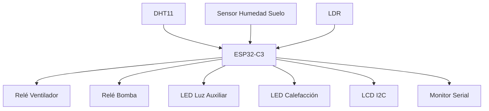

# 🌱 Sistema de Monitoreo y Control de Invernadero


## 📖 Descripción

Este proyecto implementa un sistema automatizado de monitoreo y control para un invernadero utilizando una **ESP32-C3 Super Mini**.

El sistema monitorea:

* 🌡️ Temperatura ambiental
* 💧 Humedad ambiental
* 🌱 Humedad del suelo
* ☀️ Luminosidad

Y controla automáticamente:

* 🌬️ Ventilación
* 🚿 Riego
* 💡 Iluminación auxiliar
* 🔥 Calefacción (simulada)

---

## 👨‍💻 Integrantes

| Nombre                     | Carné         | Correo                                            |
| -------------------------- | ------------- | ------------------------------------------------- |
| Brandon Ezequias Nij López | 6590-23-19976 | [bnijl@miumg.edu.gt](mailto:bnijl@miumg.edu.gt)   |
| Eddin Fernando Nij López   | 6590-23-19988 | [enijl1@miumg.edu.gt](mailto:enijl1@miumg.edu.gt) |

---

## 🛠️ Hardware Utilizado

* ESP32-C3 Super Mini
* Sensor DHT11
* Sensor de humedad de suelo
* Sensor LDR
* Pantalla LCD I2C 16x2
* Relé para ventilador
* Relé para bomba de agua
* LED para luz auxiliar
* LED para simulación de calefacción

---

## 🔌 Distribución de Pines

| GPIO  | Función                    |
| ----- | -------------------------- |
| GPIO0 | Sensor de humedad de suelo |
| GPIO1 | Sensor LDR                 |
| GPIO2 | Relé ventilador            |
| GPIO3 | Relé bomba                 |
| GPIO4 | Sensor DHT11               |
| GPIO5 | LED luz auxiliar           |
| GPIO6 | LED calefacción            |
| GPIO8 | SDA LCD                    |
| GPIO9 | SCL LCD                    |

---

## 📚 Librerías Requeridas

```cpp
#include <Wire.h>
#include <LiquidCrystal_I2C.h>
#include <DHT.h>
```

### Dependencias

* Wire
* LiquidCrystal_I2C
* DHT Sensor Library (Adafruit)

---

## ⚙️ Configuración del Arduino IDE

### Placa

```text
ESP32C3 Dev Module
```

### Configuración recomendada

```text
Tools → USB CDC On Boot → Enabled
```

### Monitor Serial

```text
115200 baudios
```

---

## 🚀 Funcionalidades

### 🌬️ Ventilación Automática

Condición:

```text
Temperatura > 30°C
```

Acción:

```text
Activar ventilador
```

---

### 🚿 Riego Automático

Condición:

```text
Humedad del suelo < 40%
```

Acción:

```text
Activar bomba de agua
```

---

### 💡 Luz Auxiliar

Condición:

```text
Luminosidad < 200 lux
```

Acción:

```text
Encender iluminación auxiliar
```

---

### 🔥 Calefacción

Condición:

```text
Temperatura < 15°C
```

Acción:

```text
Activar calefacción simulada
```

---

## 📺 Pantalla LCD

La pantalla alterna cada 5 segundos entre:

### Vista de Sensores

```text
T:25.5 H:60
S:55% L:450
```

### Vista de Actuadores

```text
Vent:ON
Riego:OFF
```

---

## 📈 Salida del Monitor Serial

```text
========== INVERNADERO ==========

Temperatura: 28.5 C
Humedad Ambiente: 65 %

Humedad Suelo: 55 %

Luminosidad: 450 lux

Ventilador: APAGADO
Bomba: APAGADA
Luz Auxiliar: APAGADA
Calefactor: APAGADO

=================================
```

---

## 🔬 Calibración

### Humedad del Suelo

```cpp
int humedadSuelo = map(soilRaw, 4095, 2400, 0, 100);
```

| Valor | Estado |
| ----- | ------ |
| 4095  | Seco   |
| 2400  | Húmedo |

### Luminosidad

```cpp
int lux = map(ldrRaw, 0, 4095, 0, 10000);
```

---

## 🏗️ Arquitectura General



---

## 📂 Estructura del Proyecto

```text
📦 InvernaderoESP32
 ┣ 📜 Invernadero.ino
 ┣ 📜 README.md
 ┗ 📂 docs
     ┣ 📷 circuito.jpg
     ┣ 📷 prototipo.jpg
     ┗ 📄 documentación.pdf
```

---

## 📸 Evidencias

Agregar en la carpeta `docs/`:

* circuito.jpg
* prototipo.jpg
* monitor_serial.png

Ejemplo:

```markdown


```

---

## 🎯 Objetivo

Desarrollar un sistema inteligente para el monitoreo y control automático de las condiciones ambientales de un invernadero, utilizando sensores y actuadores conectados a una ESP32-C3 Super Mini.

---

## 📄 Licencia

Proyecto académico desarrollado para la Universidad Mariano Gálvez de Guatemala.

**Ingeniería en Sistemas de Información y Ciencias de la Computación**

**2026**
